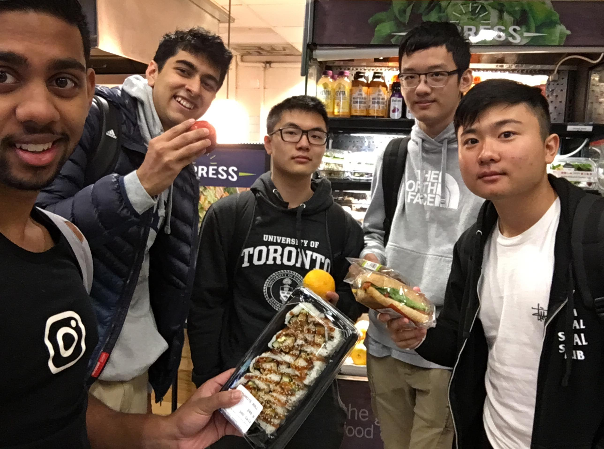
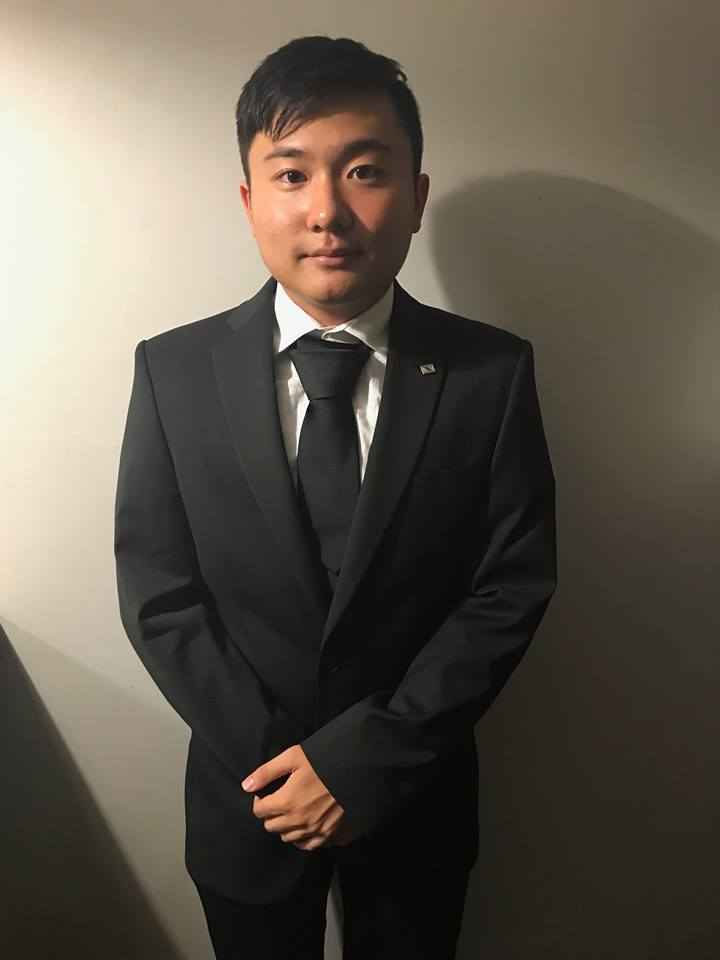

# Team9

## The Team

### Team Photo at Marketplace

#### The Team Members: Sai Oduri, Ishan Tiwari, Eric Tan, Ricky Chen and Joe Liu.

# The Members
## Biographies

### Sai Oduri

I am currently a fourth-year computer science student at the University of Toronto, who is very interested in Software Engineering as well as Web Development.

Outside of school, my hobbies include rock climbing, gymming, and videography. I'm quite the outdoorsy person and a huge extrovert, despite my interest in computer science.

My passions in life are developing code, writing articles, editing videos, teaching students, taking photos and exploring the world. Feel free to check out my article on habit formation on my <a href="https://medium.com/@saioduri/habit-formation-f137c9a4289d">Medium</a>

### Ishan Tiwari

I am a third year student at University of Toronto, specializing in the comprehensive stream. I have a wide breadth of skills and abilities including expertise in the following: Python, Java, C, SQL, Version Control with SVN and Git, SDLC with an emphasis in Agile, and finally Software Design Principles and Patterns.

Outside of my technical skills, I also have a bunch of hobbies and interests including, but not limited to: Basketball, Hockey, Football, Cricket, Table Tennis, listening to A LOT of music, and lastly watching and learning about TV and movies. All in all, I'm a big music junkie, a bigger movie buff, and a huge sports fanatic.

### Eric Tan

(Add Biographies Here)

### Ricky Chen

I am currently a third-year computer science student studying at the University of Toronto (Scarborough) campus in the software engineering stream with an expected graduation date of April 2020. I've dedicated my craft to computer science and with a passion, I strive to improve myself through every opportunity that strikes at me.

Outside of school, my hobbies include attending Microsoft sanctioned events and tournaments for games, web development and staying indoors. Naps are not an option, but a necessity. I regularly consult my peers for inspiration and advice for extracurricular projects and random things in life. For me, the most important thing I have are my relationships with my friends and family and I strive to be the best I can be every day of my life.
### Joe Liu

I am currently a second-year computer science student studying at the University of Toronto (Scarborough) campus in the entrepreneurship stream with an expected graduation date of April 2021. I am familiar with Java, Python, and a little bit of C.

My hobbies outside of school are watching anime, listening to kpop, reading manga, and playing league of legends. I also attend as many hackathons as I can in order to meet new people and hopefully build something that will have a positive impact on society.

